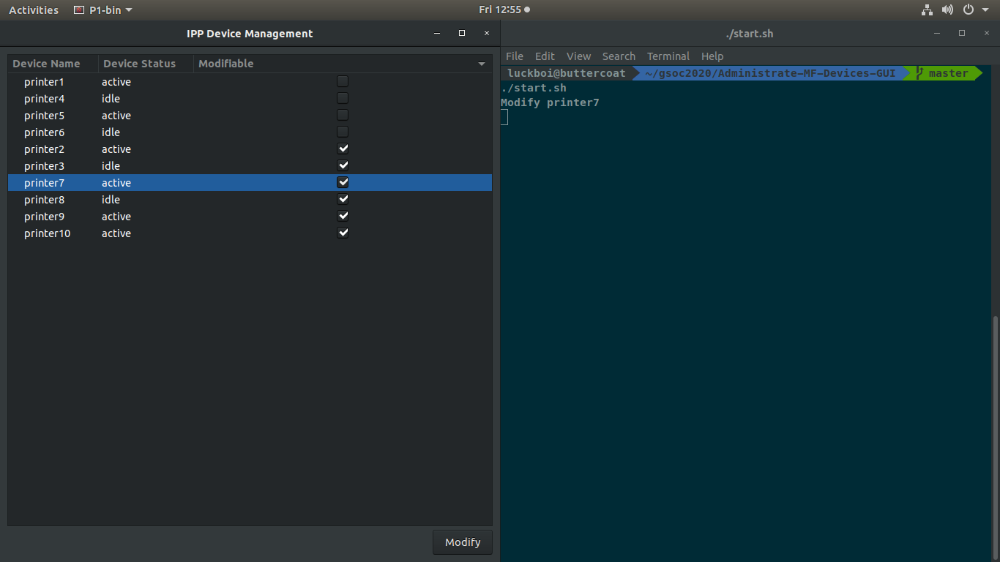
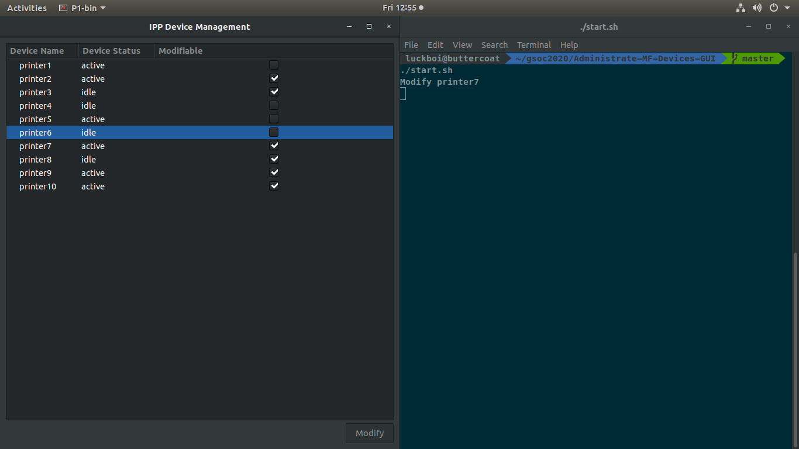

# Administrate-MF-Devices-GUI

GTK-based tool to administer IPP MF devices using IPP System Service

## Installation
gtk-3+ dev toolkit is required to build this program. 

#### Ubuntu
`sudo apt-get install libgtk-3-dev`

## Current Progress

The front page of the application is complete. 

Implemented using GtkTreeView to provide functionality to sort by any column. 